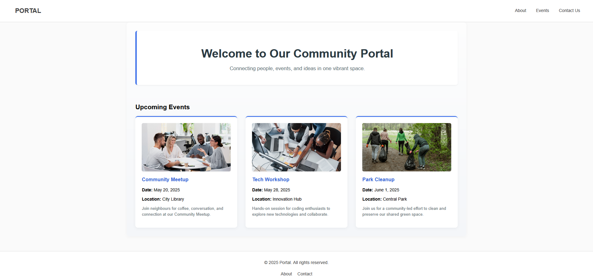
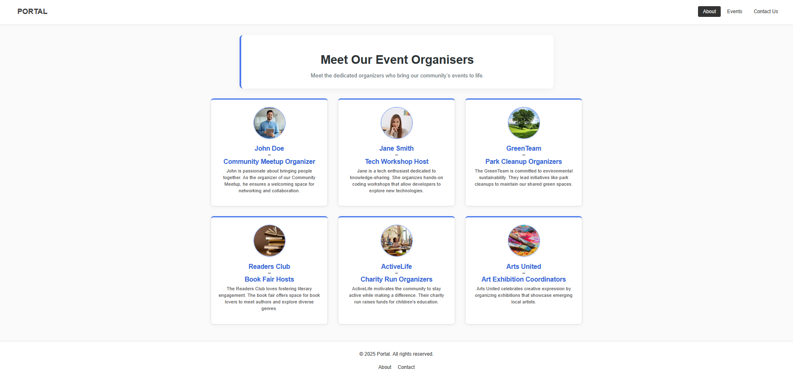
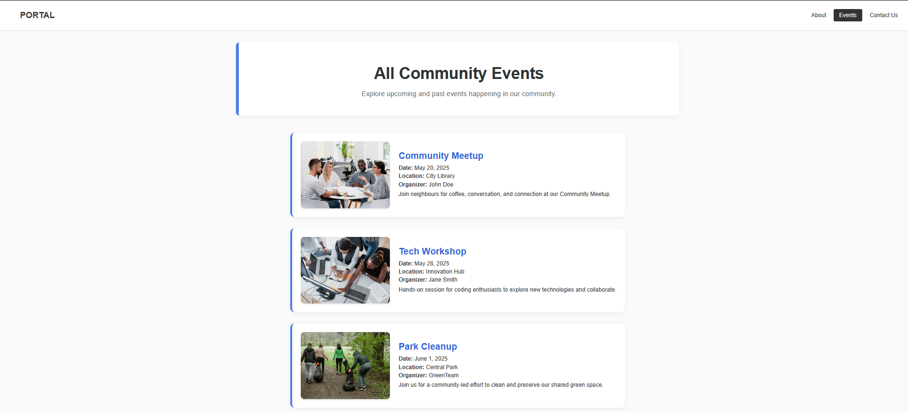
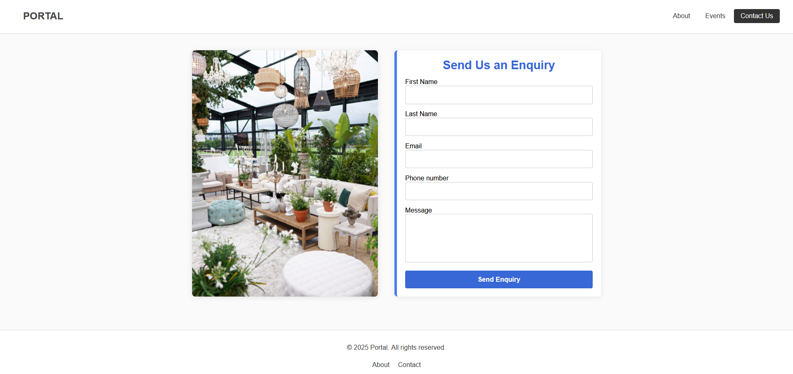

# Community Portal Website

## Overview

The **Community Portal Website** is an interactive platform designed to support local events, activities, and community engagement. Built with Node.js, Express, and EJS, it enables users to view upcoming events, explore team information, submit contact forms, and receive confirmation. The application features dynamic content rendering and a modular structure to ensure maintainability and scalability.

---

## Technologies Used

* **Node.js** – Backend runtime environment
* **Express.js** – Web framework for Node.js
* **EJS** – Templating engine for rendering dynamic HTML pages
* **HTML5** – Markup language for web structure
* **CSS3** – Styling language for web design
* **Pure.css** – Lightweight CSS framework for responsive layout and UI styling
* **JavaScript** – Scripting language for frontend interactivity
* **Express-EJS-Layouts** – Enables reusable layout templates for consistent page structure
* **Normalize.css** – CSS reset to ensure consistent styling across browsers
* **dotenv** – Loads environment variables from a `.env` file

---

## Team Members and Roles

* **Martinus Christoffel Wolmarans (577963)** – *Team Lead & Documentation Manager*
  Coordinated the project, oversaw development efforts, and maintained all project documentation, including the README and technical notes.

* **William Saunderson (600150)** – *Backend Developer*
  Developed the server-side architecture, implemented route handling, and managed the contact form POST submission logic.

* **Tiaan Scholtz (600173)** – *Frontend Developer*
  Designed and styled the UI using EJS and Pure.css, and ensured responsiveness and visual consistency across pages.

* **Morné van Rooyen (601344)** – *Data Manager*
  Managed in-memory data for events and contact submissions, ensuring correct integration between backend and frontend.

---

## Setup Instructions

To run the Community Portal Website locally:

1. **Clone the repository:**

   ```bash
   git clone https://github.com/Mc141/community-portal.git
   ```

2. **Navigate into the project directory:**

   ```bash
   cd community-portal
   ```

3. **Install dependencies:**

   ```bash
   npm install
   ```

4. **Create a `.env` file** (optional) and add the following content if needed:

   ```
   PORT=3100
   HOST=localhost
   ```

5. **Start the development server with nodemon:**

   ```bash
   npm run dev
   ```

6. **Open the app in your browser:**

   ```
   http://localhost:3100
   ```

---

## Screenshots

### Home Page



### About Page



### Events Page



### Contact Page



---

## Reflection

This group project allowed us to collaboratively develop a full-stack web application using Node.js, Express, and EJS. Through the process, we gained practical experience integrating frontend and backend logic, managing dynamic data rendering, and structuring a scalable application.

Key learnings included:

* Building modular EJS templates with partials
* Structuring clean, reusable routes and middleware
* Implementing in-memory data handling and form validation
* Designing responsive pages using Pure.css
* Managing collaboration via Git and GitHub

Each member played a vital role in shaping the final product, and through our combined efforts, we delivered a feature-complete and polished community portal. This project significantly improved our teamwork, technical communication, and full-stack proficiency.

---

## Folder Structure

```
/community-portal
│
├── /controllers
│   └── mainController.js
│
├── /data
│   ├── events.js
│   ├── organisers.js
│   └── submissions.js
│
├── /public
│   ├── /css
│   │   ├── home.css
│   │   ├── about.css
│   │   ├── events.css
│   │   └── contact.css
│   ├── /images
│   │   ├── about/
│   │   ├── contact/
│   │   └── events/
│   └── /js
│       └── form.js
│
├── /routes
│   └── pageRoutes.js
│
├── /views
│   ├── /pages
│   │   ├── home.ejs
│   │   ├── about.ejs
│   │   ├── events.ejs
│   │   ├── contact.ejs
│   │   ├── thankyou.ejs
│   │   └── 404.ejs
│   ├── /partials
│   │   ├── header.ejs
│   │   └── footer.ejs
│   └── layout.ejs
│
├── /utils
│   └── validators.js
│
├── .env
├── .gitignore
├── package.json
└── README.md
```

### Folder Descriptions

* **/controllers**: Route-handling logic and controller functions
* **/data**: Arrays and logic for events and form submissions
* **/public**: Static assets (CSS, images, JS)
* **/routes**: Modular routing setup for all pages
* **/views**: EJS templates and layout structure
* **/utils**: Helper utilities (e.g., form validation)